NAMA    :ARDHANA PRASASTA
NIM     :362358302081
KELAS   :2B TRPL

1.MEMBUAT NEW PROJECT
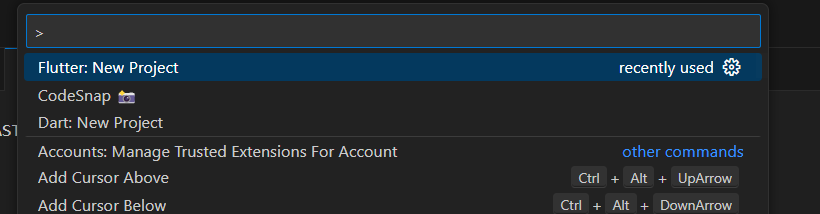

 2.MEMBUAT GITHUB YANG DIHUBUNGKAN  KEDALAM VISUAL CODE
 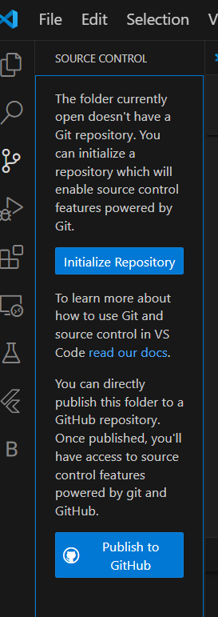

 3.REPOSITORY DI GIT
 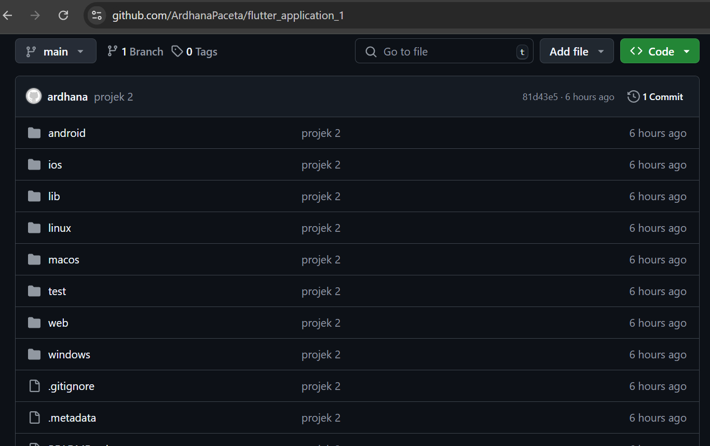

 4.MEMBUAT TEKS WIDGET
 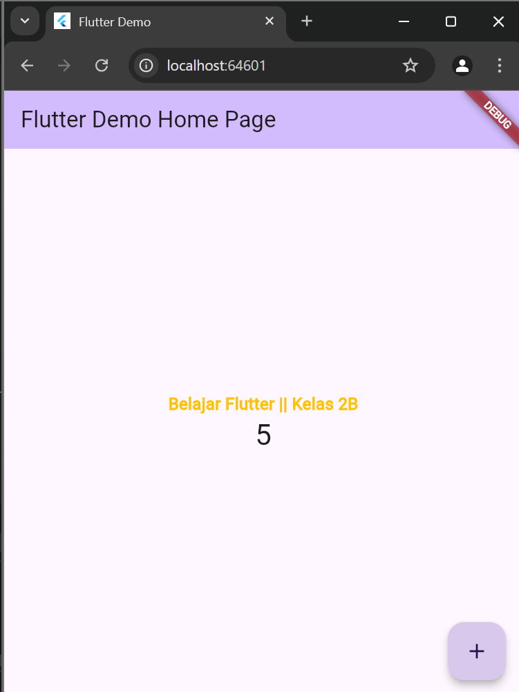

5. membuat image.dart
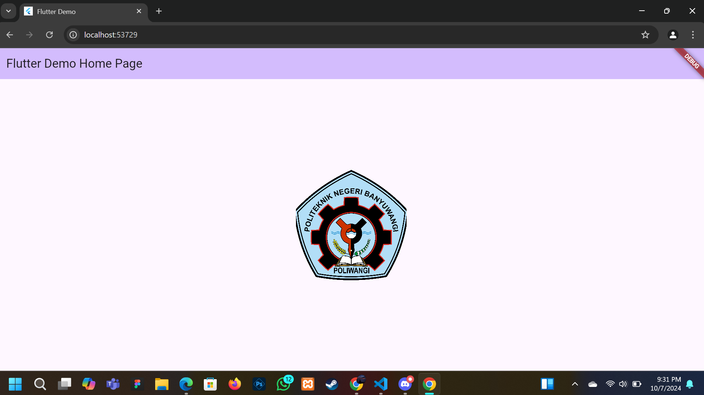

6. cuppertino 
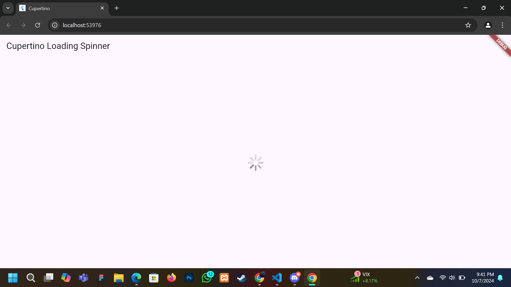

7. membuat FAB
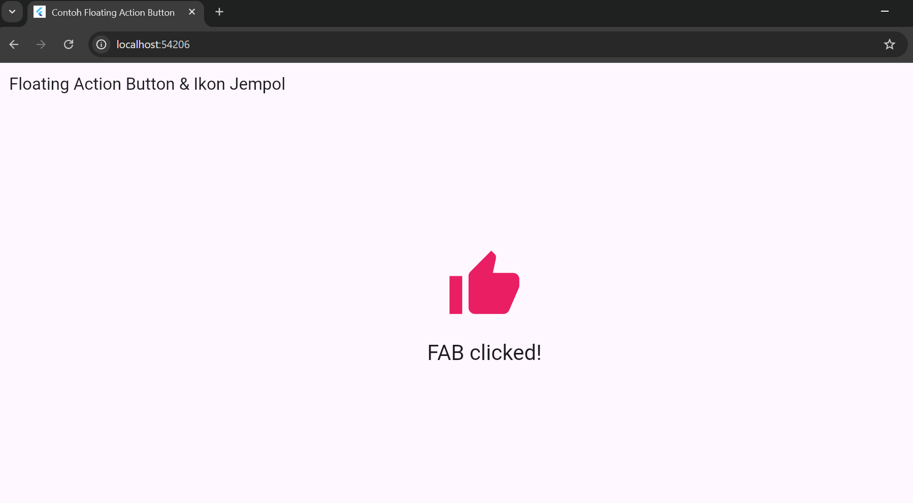

8. membuat increment myapp
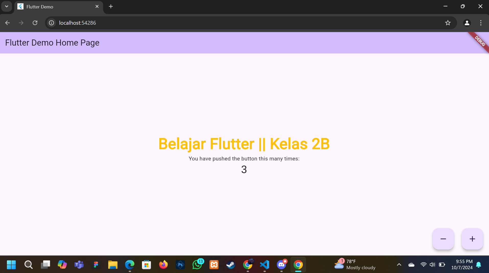

9. membuat Dialog widget pada flutter memiliki dua jenis dialog yaitu AlertDialog dan SimpleDialog.
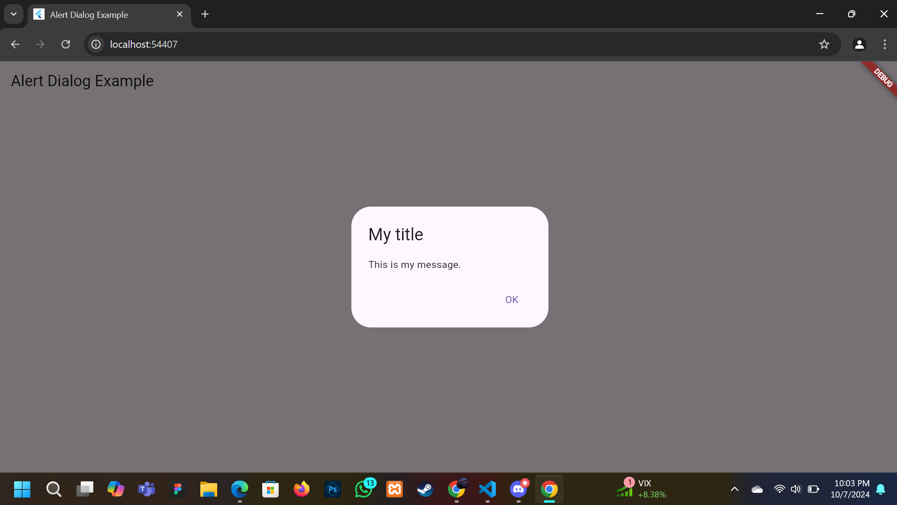

10. membuat widget yang dapat menerima input dari pengguna aplikasi yaitu antara lain Checkbox, Date and Time Pickers, Radio Button, Slider, Switch, TextField.
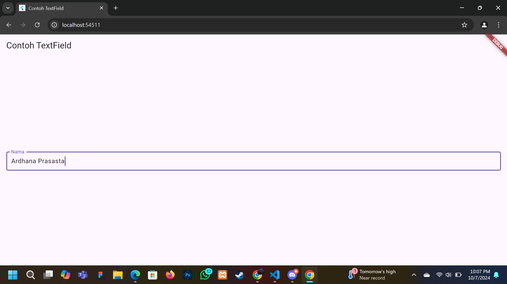

11. membuat  Date and Time Pickers Date and Time Pickers termasuk pada kategori input dan selection widget.

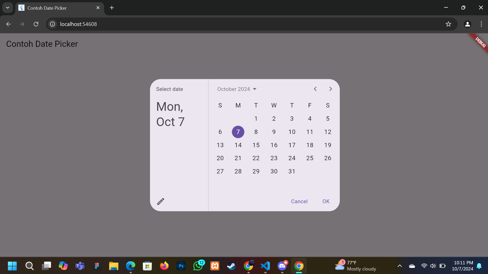

 